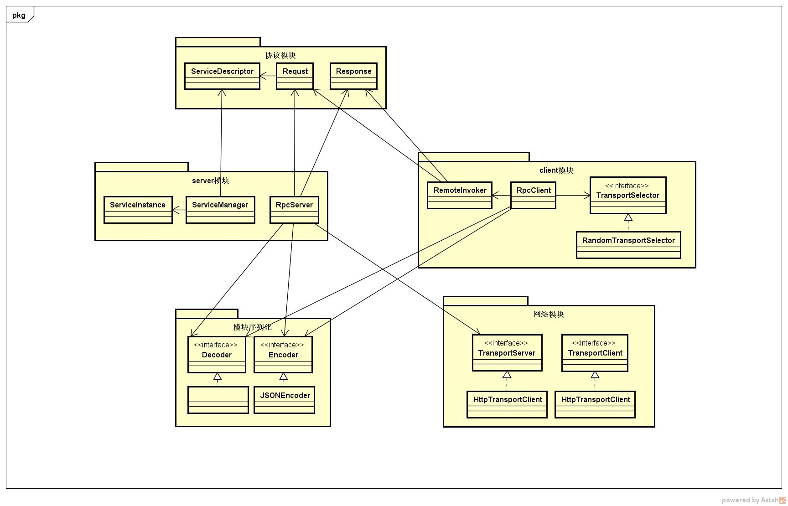

# 简单RPC框架实现

## 项目模块

1. gk-rpc-client 客户端

2. gk-rpc-codec 编码解码

3. gk-rpc-common 通用工具

4. gk-rpc-proto 通信协议

5. gk-rpc-server 服务端

6. gk-rpc-transport 网络通信

   
   
 ## RPC原理图
   
   
   
   
   
   
## 下一步

- 线程池

- 并发

- IO性能提升

- 多线程

- 半包、粘包

- 

- 数据安全传输

- 流行框架集成

  **高可用**

  负载均衡 、注册中心、心跳检测、服务降级、监控

## 2. 设计类图

